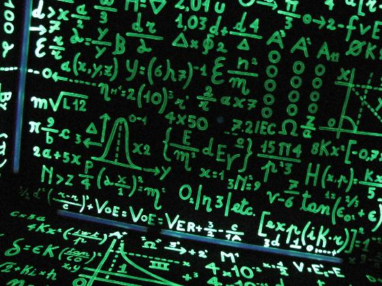

<!-- $size: 16:9 -->

Dall'Algoritmo al Codice
===



##### [Il Pensiero Computazionale](http://ilpensierocomputazionale.di.unipi.it/)
###### Percorso Formativo per i Docenti della Scuola Secondaria di II Grado
<sub><sup>[Stefano Forti](http://pages.di.unipi.it/forti) and  [Davide Neri](http://pages.di.unipi.it/neri/)</sup></sub>

---

# Che cos'è l'Informatica?

L'Informatica è lo studio di come si immagazzina ed elabora l'informazione in modo automatico. 

L'Informatica si occupa di problemi, della loro risoluzione, e delle soluzioni che vengono fuori dalla loro soluzione. 

Dato un problema, un informatico sviluppa un **algoritmo**, una serie di finita di istruzioni per risolvere qualunque istanza del problema un passo alla volta. Gli algoritmi sono soluzioni.

L'implementazione degli algoritmi, la loro **codifica** (_coding_) in un certo **linguaggio di programmazione**, è necessaria per sperimentare al calcolatore gli algoritmi progettati su carta.

---
# La Programmazione

In generale, possiamo immaginare un programma come una scatola magica che, presi dei **dati in ingresso** (_input_) produce, seguendo un algoritmo, un **risultato in uscita** (_output_). 


La funzione ```math.sqrt(n)``` restituisce la radice quadrata di ```n```:

```python
import math # importiamo la libreria matematica
n = 16 # assegniamo ad n il valore 16
print(math.sqrt(n)) # il risultato è...?
```

---
# Python: da 0 a 100 (o quasi) in 2 ore... :hourglass_flowing_sand:

<center>
  
</center>

---

# ```import this```

```md
The Zen of Python, by Tim Peters

Beautiful is better than ugly.
Explicit is better than implicit.
Simple is better than complex.
Complex is better than complicated.
Flat is better than nested.
Sparse is better than dense.
Readability counts.
Special cases aren't special enough to break the rules.
Although practicality beats purity.
Errors should never pass silently.
Unless explicitly silenced.
In the face of ambiguity, refuse the temptation to guess.
There should be one-- and preferably only one --obvious way to do it.
Although that way may not be obvious at first unless you're Dutch.
Now is better than never.
Although never is often better than *right* now.
If the implementation is hard to explain, it's a bad idea.
If the implementation is easy to explain, it may be a good idea.
Namespaces are one honking great idea -- let's do more of those!
```
---

# Variabili

I linguaggi di programmazione usano dei barattoli etichettati per contenere dati.

<center>
	
</center>

L'operazione fondamentale sulle variabili è l'**assegnamento** (```=```):

```python
anni = 27
print(anni) # il risultato è...?
anni = anni + 1
print(anni) # il risultato è...?
```
---
# Tipi di Dato

In Python i dati possono essere di tre tipi principali, ciascuno con le sue operazioni:

- ```int``` o ```float``` (numeri interi o decimali), 
- ```bool``` (valori booleani, vero/falso), 
- ```str``` (stringhe di testo, sempre tra virgolette ```"ciao"``` o apici singoli ```'ciao'```).

Per identificare il tipo di una variabile ```v``` basta usare la funzione ```print(type(v))```.


```python
n = 16
print(type(n))

b = False
print(type(b))

s = 'ciao'
print(type(s))
```

---
# Numeri (```int``` o ```float```)

Proviamo queste operazioni in Python interattivo! :smile:

```python
print(2+3*4)
print((2+3)*4)
print(2**10)
print(6/3)
print(7/3)
print(7//3)
print(7%3)
print(3/6)
print(3//6)
print(3%6)
print(2**100)
```
A quali operazioni corrispondono ```**```, ```//``` e ```%```?

--- 
# Booleani (```bool```)

I tipi booleani sono equipaggiati con i tre principali operatori ```and``` ($\wedge$), ```or``` ($\vee$), ```not``` ($\neg$) definiti secondo l'algebra di Boole:

- ```a1 and ... and ak``` è ```True``` se e solo se ```a1, ..., ak``` sono tutte ```True```,
- ```a1 or ... or ak``` è ```True``` se e solo se almeno una tra ```a1, ..., ak``` è ```True```,
- ```not(a)``` è ```True``` se ```a``` è ```False``` e, viceversa, è ```False``` se ```a``` è ```True```.

```python
print(5==10)
print(10 > 5)
print((5 >= 1) and (5 <= 10))

a = 30 > 8
b = 6 != 4 # != corrisponde a 'diverso da', 'non è uguale'
print(a and b)
print(a or b)
print(a and not(b))
```

--- 
# Stringhe (```str```) 


Sono dichiarate come una sequenza di **caratteri** fra apici singoli  (```'foo'```) o doppi (```"foo"```).
Sono **immutabili**, ovvero una volta definite non possono essere modificate. 
Supportano le seguenti operazioni:

```python
s = "Python"

# Accesso al carattere i-esimo
s = 'Python'
print(s[0])   # elemento in posizione 0 (il primo)
print(s[5])   # elemento in posizione 5 (il sesto)
print(s[-1])  # elemento in posizione -1 (l'ultimo)
print(s[-4])  # elemento in posizione -4 (il quartultimo)

# Slicing
print(s[0:2])  # sottostringa con elementi da 0 (incluso) a 2 (escluso) -> 'Py'
print(s[:2])   # dall'inizio all'elemento con indice 2 (escluso)        -> 'Py'
print(s[3:5])  # dall'elemento con indice 3 (incluso) a 5 (escluso)     -> 'ho'
print(s[4:])   # dall'elemento con indice 4 (incluso) alla fine         -> 'on'
print(s[-2:])  # dall'elemento con indice -2 (incluso) alla fine        -> 'on'
```

--- 
# Stringhe (cont.)

```python
# concatenazione e ripetizione
print('Py' + 'thon')     
print('Py' * 2)         
print('Ba' + 'na' * 2)   

# Presenza di una stringa in un'altra stringa
s = 'Python'
print('P' in s)  
print('x' in s) 
print( 'x' not in s)   
print('Py' in s) 

# Lunghezza di una stringa
print(len('Python'))  
s = 'Precipitevolissimevolmente'
print(len(s))          
```

--- 
# Stringhe (cont.)

```python
# concatenazione e ripetizione
print('Py' + 'thon')     # Concatena la stringa "Py" con "thon"          -> 'Python'
print('Py' * 2)          # Ripeti per due volte la stringa "Py"          -> 'PyPy'
print('Ba' + 'na' * 2)   # Concatena "ba" con una doppia ripetizione di "na" ->'Banana'

# Presenza di una stringa in un'altra tringa
s = 'Python'
print('P' in s)  # controlla se 'P' è contenuto nella stringa s -> True
print('x' in s)  # il carattere 'x' non è in s                  -> False
print( 'x' not in s)   # "not in" esegue l'operazione inversa   -> True
print('Py' in s)  # controlla se 'Py' è contenuto in s           ->True

# Lunghezza di una stringa
print(len('Python'))   # stampa la lunghezza della stringa -> 6
s = 'Precipitevolissimevolmente'
print(len(s))           # -> 26
```
---

# Liste 

Una lista è una collezione ordinata di zero o più elementi (:warning: anche eterogenei per tipo!).


```python
myList = [1, 3, True, 6.5]
print(myList)

# lunghezza lista e contenuto
print(len(myList))
print(3 in myList)

# accedere un elemento
print(myList[0])
print(myList[2])

# concatenare liste
myList2 = [6, 95.2, 'ciao']
myList3 = myList + myList2
print(myList3)
```

Gli elementi di una lista di ```n``` elementi sono indicizzati da ```0``` a ```n-1```.

---
# Funzioni su Liste 

```python
myList = [1024, 3, True, 6.5]
myList.append(False) 
print(myList)
myList.insert(2,4.5) 
print(myList)
print(myList.pop()) 
print(myList)
print(myList.pop(1))
print(myList)
myList.sort() 
print(myList)
myList.reverse() 
print(myList)
print(myList.count(6.5))
print(myList.index(4.5)) 
myList.remove(6.5) 
print(myList)
del myList[0] 
print(myList)
```
 

---
# Funzioni su Liste

```python
myList = [1024, 3, True, 6.5]
myList.append(False) # aggiungere elementi alla fine
print(myList)
myList.insert(2,4.5) # inserire elemento in posizione 2
print(myList)
print(myList.pop()) # rimuovere e restituire l'ultimo elemento
print(myList)
print(myList.pop(1)) # rimuovere e restituire l'elemento 1
print(myList)
myList.sort() # ordinare la lista
print(myList)
myList.reverse() # invertire la lista
print(myList)
print(myList.count(6.5)) # contare quante volte compare un elemento
print(myList.index(4.5)) # ottenere la posizione di un elemento
myList.remove(6.5) # rimuovere la prima occorrenza di un elemento
print(myList)
del myList[0] # rimuovere un elemento indicato
print(myList)
```
---

# Input e Output

La funzione di output in Python è, come abbiamo visto, la ```print()```.

La funzione di input in Python è invece la ```input(msg)``` che prende come parametro opzionale ```msg``` un messaggio di cortesia destinato all'utente.

Il risultato della ```input(msg)``` è una stringa che contiene quanto digitato dall'utente prima di premere invio.

```python
nome = input('Inserisci il tuo nome: ')
anni = int(input('Inserisci la tua età: ')) # int converte in intero la stringa

print("Ciao", nome, "di anni", anni)
```

---
# Strutture di Controllo

Il **costrutto iterativo** (ovvero che ripete un dato comando) e quello **condizionale** (che sceglie se eseguire un dato comando) sono alla base di tutti i linguaggi di programmazione.

---
# Costrutti Iterativi (Cicli)

#### Costrutto Iterativo Indefinito (```while```)

```python
counter = 0
while counter < 5: # ripete finché la condizione (counter < 5) è vera
    print("Hello, World!")
    counter = counter + 1
```

#### Costrutto Iterativo Definito (```for```)

```python
for i in range(5):
    print("Hello, World!")
    
for elemento in ['ciao', 'come', 'stai', '?']:
    print(elemento)
```
---

# Costrutto Condizionale

#### Costrutto Condizionale Semplice (```if-then```)


```python
numero = int(input('Inserire il dividendo:'))

if divisore != 0:
   risultato = dividendo / divisore
   print(dividendo, 'diviso', divisore, 'è uguale a', 'risultato')
else:
   print('Impossibile dividere per 0!')
```

#### Costrutto Condizionale a Due Rami (```if-then-else```)

```python
dividendo = int(input('Inserire il dividendo:'))
divisore = int(input('Inserire il divisore:'))

if divisore != 0:
   risultato = dividendo / divisore
   print(dividendo, 'diviso', divisore, 'è uguale a', 'risultato')
else:
   print('Impossibile dividere per 0!')
```

--- 
# Costrutto Condizionale

#### Costrutto Condizionale  (```switch```-like)

```python
risultato = int(input('Inserire il voto del compito:'))

if risultato >= 90:
    print('A')
elif risultato >=80:
    print('B')
elif risultato >= 70:
    print('C')
elif risultato >= 60:
    print('D')
else:
    print('F')
```


--- 
# Problema: Sotto-sequenza Massima


ouough

<center>
	
</center>


--- 
# Sotto sequenza massima (definizione formale)

> Data una lista $D$ di $n$ interi (positivi e negativi), come si può stabilire la sottolista di somma massima, ovvero come possiamo scegliere due valori, $a$ e $b$, tali da ottenere il massimo $\max \limits_{a,b \in \mathbb{N}_{n}}\{\sum_{i=a}^b D[i]\}$? 

Esistono almeno tre soluzioni rispettivamente di complessità cubica $O(n^3)$, quadratica $O(n^2)$ e lineare $O(n)$. 

:nerd_face: Scrivere lo pseudocodice di almeno due soluzioni e implementare la più efficiente.


--- 
# Algoritmo cubico (sotto sequenza massima)

```python
def cubico(d):
    n = len(d)                       # n indica il numero di elementi di d
    max_somma = -float('inf')
    a = 1
    v = 0

    for i in range(1, n):
        for j in range(i, n):
            tmp = 0  # tmp e' un valore temporaneo
            for k in range(i, j + 1):  # sommiamo gli elementi in d[i,j]
                tmp = tmp + d[k]
            if tmp > max_somma:
                max_somma = tmp
                a = i
                v = j

    print ("Il guadagno massimo e' {}".format(max_somma))
    print ("Esso si realizza nell'intervallo di giorni [{},{}]".format(a, v))
    print ("Porzione di d avente somma massima {}".format(d[a:v+1]))
 ```


--- 
# Algoritmo quadratico (sotto sequenza massima)

```python
def quadratico(d):
    n = len(d)                       # n indica il numero di elementi di d
    max_somma = -float('inf')
    a = 1
    v = 0

    for i in range(1, n):
        tmp = 0                      # tmp e' un valore temporaneo
        for j in range(i, n):
            tmp = tmp + d[j]
            if tmp > max_somma:
                max_somma = tmp
                a = i
                v = j

    print ("Il guadagno massimo e' {}".format(max_somma))
    print ("Esso si realizza nell'intervallo di giorni [{},{}]".format(a, v))
    print ("Porzione di d avente somma massima {}".format(d[a:v+1]))
 ```
 
 --- 
 
# Algoritmo lineare* (sotto sequenza massima)

```python
def lineare(d):
    n = len(d)  # n indica il numero di elementi di d
    max_somma = -float('inf')
    a = 1
    v = 0
    atmp = a  # atmp e' un indice temporaneo
    tmp = 0  # tmp e' un valore temporaneo

    for i in range(1, n):
        tmp = tmp + d[i]
        if tmp > max_somma:
            max_somma = tmp
            a = atmp
            v = i
        if tmp < 0:
            tmp = 0
            atmp = i + 1

    print ("Il guadagno massimo e' {}".format(max_somma))
    print ("Esso si realizza nell'intervallo di giorni [{},{}]".format(a, v))
    print ("Porzione di d avente somma massima {}".format(d[a:v+1]))
```

---
# Multi-key Quick Sort (Idea e Complessità)

Come si ordina una collezione $S$ di $n$ parole di lunghezza $L$?

:bulb: _L'algoritmo è simile al Quick Sort._

L'idea di base segue due passi:
1. Sceglie una stringa $p$ (_pivot_) tra quelle da ordinare e divide la collezione $S$ in tre sotto-collezioni, una $S_{\lt}$ con le stringhe $e[r] \lt p[r]$, una $S_{=}$ con le strighe $e[r] = p[r]$ la terza $S_{\gt}$ con le stringhe $e[r] \gt p[r]$.
2. Ripete (1) su $\langle S_{\lt}, r\rangle$, $\langle S_{=}, r+1\rangle$ e $\langle S_{\gt}, r\rangle$.

La complessità è di $O(D+n\lg n)$ dove $D$ è la lunghezza del prefisso distintivo di $S$ (ovvero, quello che distingue una stringa da tutte le altre).


---
# Multi-key Quick Sort (Demo)

<center>
	
</center>

---
# Multi-key Quick Sort (Demo)

<center>
	
</center>

---
# Multi-key Quick Sort (Codice)

```python
def multikeyQS(S,k):
    if (len(S) <= 1):
        return S
    pivot_pos = random.randint(0, len(S)-1)
    pivot_char = S[pivot_pos][k]
    S1 = []
    S2 = []
    S3 = []
    for s in S:
        if (s[k] < pivot_char): 
            S1.append(s)
        elif (s[k] == pivot_char):
                S2.append(s)
        else: 
            S3.append(s)
    L1 = multikeyQS(S1,k)
    L2 = multikeyQS(S2,k+1)
    L3 = multikeyQS(S3,k)
    return L1+L2+L3
```
---

# Il Problema dello Zaino

---
# Esercizi

> 
