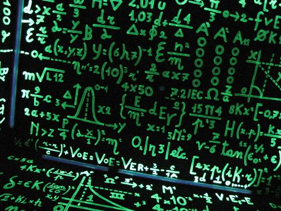

<!-- $size: 16:9 -->

Dall'Algoritmo al Codice
===



##### [Il Pensiero Computazionale](http://ilpensierocomputazionale.di.unipi.it/)
###### Percorso Formativo per i Docenti della Scuola Secondaria di II Grado
<sub><sup>[Stefano Forti](http://pages.di.unipi.it/forti) and  [Davide Neri](http://pages.di.unipi.it/neri/)</sup></sub>

---

# Che cos'è l'Informatica?

L'Informatica è lo studio di come si immagazzina ed elabora l'informazione in modo automatico. 

L'Informatica si occupa di problemi, della loro risoluzione, e delle soluzioni che vengono fuori dalla loro soluzione. 

Dato un problema, un informatico sviluppa un **algoritmo**, una serie di finita di istruzioni per risolvere qualunque istanza del problema un passo alla volta. Gli algoritmi sono soluzioni.

L'implementazione degli algoritmi, la loro **codifica** (_coding_) in un certo **linguaggio di programmazione**, è necessaria per sperimentare al calcolatore gli algoritmi progettati su carta.

---
# La Programmazione

In generale, possiamo immaginare un programma come una scatola magica che, presi dei **dati in ingresso** (_input_) produce, seguendo un algoritmo, un **risultato in uscita** (_output_). 


La funzione ```math.sqrt(n)``` restituisce la radice quadrata di ```n```:

```python
import math # importiamo la libreria matematica
n = 16 # assegniamo ad n il valore 16
print(math.sqrt(n)) # il risultato è...?
```

---
# Python: da 0 a 100 (o quasi) in 2 ore... :hourglass_flowing_sand:

<center>
  
</center>

---

# ```import this```

```md
The Zen of Python, by Tim Peters

Beautiful is better than ugly.
Explicit is better than implicit.
Simple is better than complex.
Complex is better than complicated.
Flat is better than nested.
Sparse is better than dense.
Readability counts.
Special cases aren't special enough to break the rules.
Although practicality beats purity.
Errors should never pass silently.
Unless explicitly silenced.
In the face of ambiguity, refuse the temptation to guess.
There should be one-- and preferably only one --obvious way to do it.
Although that way may not be obvious at first unless you're Dutch.
Now is better than never.
Although never is often better than *right* now.
If the implementation is hard to explain, it's a bad idea.
If the implementation is easy to explain, it may be a good idea.
Namespaces are one honking great idea -- let's do more of those!
```
---

# Variabili

I linguaggi di programmazione usano dei barattoli etichettati per contenere dati.

<center>
	
</center>

L'operazione fondamentale sulle variabili è l'**assegnamento** (```=```):

```python
anni = 27
print(anni) # il risultato è...?
anni = anni + 1
print(anni) # il risultato è...?
```
---
# Tipi di Dato

In Python i dati possono essere di tre tipi principali, ciascuno con le sue operazioni:

- ```int``` o ```float``` (numeri interi o decimali), 
- ```bool``` (valori booleani, vero/falso), 
- ```str``` (stringhe di testo, sempre tra virgolette ```"ciao"``` o apici singoli ```'ciao'```).

Per identificare il tipo di una variabile ```v``` basta usare la funzione ```print(type(v))```.


```python
n = 16
print(type(n))

b = False
print(type(b))

s = 'ciao'
print(type(s))
```

---
# Numeri (```int``` o ```float```)

Proviamo queste operazioni in Python interattivo! :smile:

```python
print(2+3*4)
print((2+3)*4)
print(2**10)
print(6/3)
print(7/3)
print(7//3)
print(7%3)
print(3/6)
print(3//6)
print(3%6)
print(2**100)
```
A quali operazioni corrispondono ```**```, ```//``` e ```%```?

--- 
# Booleani (```bool```)

I tipi booleani sono equipaggiati con i tre principali operatori ```and``` ($\wedge$), ```or``` ($\vee$), ```not``` ($\neg$) definiti secondo l'algebra di Boole:

- ```a1 and ... and ak``` è ```True``` se e solo se ```a1, ..., ak``` sono tutte ```True```,
- ```a1 or ... or ak``` è ```True``` se e solo se almeno una tra ```a1, ..., ak``` è ```True```,
- ```not(a)``` è ```True``` se ```a``` è ```False``` e, viceversa, è ```False``` se ```a``` è ```True```.

```python
print(5==10)
print(10 > 5)
print((5 >= 1) and (5 <= 10))

a = 30 > 8
b = 6 != 4 # != corrisponde a 'diverso da', 'non è uguale'
print(a and b)
print(a or b)
print(a and not(b))
```

--- 
# Stringhe (```str```) 


Sono sequenze come una sequenza di *caratteri* fra apici (```' '```, ```" "```) e sono **immutabili** (una volta definite non possono essere modificate. 
Supportano le operazini di una **sequenza** (come le liste) (e.g.  *indicizazione*, *slicing*, *concatenamento*, *ripetizione* e *lunghezza*).

```python
s = "Python"

# Indicizazione
s = 'Python'
print(s[0])   # elemento in posizione 0 (il primo)
print(s[5])   # elemento in posizione 5 (il sesto)
print(s[-1])  # elemento in posizione -1 (l'ultimo)
print(s[-4])  # elemento in posizione -4 (il quartultimo)

# Slicing
print(s[0:2])  # sottostringa con elementi da 0 (incluso) a 2 (escluso) -> 'Py'
print(s[:2])   # dall'inizio all'elemento con indice 2 (escluso)        -> 'Py'
print(s[3:5])  # dall'elemento con indice 3 (incluso) a 5 (escluso)     -> 'ho'
print(s[4:])   # dall'elemento con indice 4 (incluso) alla fine         -> 'on'
print(s[-2:])  # dall'elemento con indice -2 (incluso) alla fine        -> 'on'
```
--- 
# Stringhe (cont.)
È possibile usare l’operatore + per *concatenare* sequenze, e * per *ripetere* sequenze:

```python
print('Py' + 'thon')     # Concatena la stringa "Py" con "thon"          -> "Python
print('Py' * 2)          # Ripeti per due volte la stringa "Py"          -> 'PyPy'
print('Ba' + 'na' * 2)   # Concatenata "ba" alla ripetizioni di due "na" ->'Banana'
```
Gli operatori ```in```e ```not in``` possono essere usati per verificare se un elemento fa parte di una stringa o no. 

```python
s = 'Python'
print('P' in s)  # controlla se 'P' è contenuto nella stringa s -> True
print('x' in s)  # il carattere 'x' non è in s                  -> False
print( 'x' not in s)   # "not in" esegue l'operazione inversa   -> True
print('Py' in s)  # controlla se'Py' è contenuto in s           ->True
```
La funzione built-in ```len()``` può essere usata per ottenere il numero di elementi nella stringa:

```python
# Lunghezza
print(len('Python'))   # stampa la lunghezza della stringa -> 6
s = 'Precipitevolissimevolmente'
print(len(s))           # -> 26
```
---

# Liste 

Una lista è una collezione ordinata di zero o più elementi (:warning: anche eterogenei per tipo!).


```python
myList = [1, 3, True, 6.5]
print(myList)

# lunghezza lista e contenuto
print(len(myList))
print(3 in myList)

# accedere un elemento
print(myList[0])
print(myList[2])

# concatenare liste
myList2 = [6, 95.2, 'ciao']
myList3 = myList + myList2
print(myList3)
```

Gli elementi di una lista di ```n``` elementi sono indicizzati da ```0``` a ```n-1```.

---
# Funzioni su Liste 

```python
myList = [1024, 3, True, 6.5]
myList.append(False) 
print(myList)
myList.insert(2,4.5) 
print(myList)
print(myList.pop()) 
print(myList)
print(myList.pop(1))
print(myList)
myList.sort() 
print(myList)
myList.reverse() 
print(myList)
print(myList.count(6.5))
print(myList.index(4.5)) 
myList.remove(6.5) 
print(myList)
del myList[0] 
print(myList)
```
 

---
# Funzioni su Liste

```python
myList = [1024, 3, True, 6.5]
myList.append(False) # aggiungere elementi alla fine
print(myList)
myList.insert(2,4.5) # inserire elemento in posizione 2
print(myList)
print(myList.pop()) # rimuovere e restituire l'ultimo elemento
print(myList)
print(myList.pop(1)) # rimuovere e restituire l'elemento 1
print(myList)
myList.sort() # ordinare la lista
print(myList)
myList.reverse() # invertire la lista
print(myList)
print(myList.count(6.5)) # contare quante volte compare un elemento
print(myList.index(4.5)) # ottenere la posizione di un elemento
myList.remove(6.5) # rimuovere la prima occorrenza di un elemento
print(myList)
del myList[0] # rimuovere un elemento indicato
print(myList)
```
---

# Input e Output

La funzione di output in Python è, come abbiamo visto, la ```print()```.

La funzione di input in Python è invece la ```input(msg)``` che prende come parametro opzionale ```msg``` un messaggio di cortesia destinato all'utente.

Il risultato della ```input(msg)``` è una stringa che contiene quanto digitato dall'utente prima di premere invio.

```python
nome = input('Inserisci il tuo nome: ')
anni = int(input('Inserisci la tua età: ')) # int converte in intero la stringa

print("Ciao", nome, "di anni", anni)
```

---
# Strutture di Controllo

Il **costrutto iterativo** (ovvero che ripete un dato comando) e quello **condizionale** (che sceglie se eseguire un dato comando) sono alla base di tutti i linguaggi di programmazione.

---
# Costrutti Iterativi (Cicli)

#### Costrutto Iterativo Indefinito (```while```)

```python
counter = 0
while counter < 5: # ripete finché la condizione (counter < 5) è vera
    print("Hello, World!")
    counter = counter + 1
```

#### Costrutto Iterativo Definito (```for```)

```python
for i in range(5):
    print("Hello, World!")
    
for elemento in ['ciao', 'come', 'stai', '?']:
    print(elemento)
```
---

# Costrutto Condizionale

#### Costrutto Condizionale Semplice (```if-then```)


```python
numero = int(input('Inserire il dividendo:'))

if divisore != 0:
   risultato = dividendo / divisore
   print(dividendo, 'diviso', divisore, 'è uguale a', 'risultato')
else:
   print('Impossibile dividere per 0!')
```

#### Costrutto Condizionale a Due Rami (```if-then-else```)

```python
dividendo = int(input('Inserire il dividendo:'))
divisore = int(input('Inserire il divisore:'))

if divisore != 0:
   risultato = dividendo / divisore
   print(dividendo, 'diviso', divisore, 'è uguale a', 'risultato')
else:
   print('Impossibile dividere per 0!')
```

--- 
# Costrutto Condizionale

#### Costrutto Condizionale  (```switch```-like)

```python
risultato = int(input('Inserire il voto del compito:'))

if risultato >= 90:
    print('A')
elif risultato >=80:
    print('B')
elif risultato >= 70:
    print('C')
elif risultato >= 60:
    print('D')
else:
    print('F')
```

---
# Un problema dalle Olimpiadi della Matematica (2015)

<center>
	
</center>

### Lavoro di Squadra!
###### Provate a risolvere il problema :smile:

---
# Suggerimento

Federica può applicare al mucchio di graffette ciascuna di queste due funzioni ripetutamente:

$$f(n) = n - 3\ \ if\ n\geqslant 3$$
$$g(n) = n/2\ \ if\ n=2k$$

Federica vince se rimangono $0$ graffette. Ciò è possibile se e solo se, alla penultima mossa, ci sono $3$ graffette sul tavolo.

<center>
	
</center>

---
# Soluzione

I numeri buoni sono dunque tutti quelli nell'intervallo $[3, 2015]$ che portano a $3$ graffette residue con una certa sequenza di applicazioni di $f$ e $g$.

Le possiamo generare (e contare!) semplicemente col seguente codice Python.

```python
soluzione = [0] * 2015 # crea una lista con 2015 zeri
soluzione[3] = 1

for i in range(3, 2015):
   if (soluzione[i] == 1):
      solUno = i * 2 # un numero a cui applicare g
      solDue = i + 3 # un numero a cui applicare f
   
      if (solUno < 2015):
         soluzione[solUno] = 1
      if (solDue < 2015):
         soluzione[solDue] = 1

print(sum(soluzione))
```
---
# Come si risolve (b)?

```python
soluzione = [0] * 2015
soluzione[1] = 1

for i in range(1, 2015):
   if (soluzione[i] == 1):
      solUno = i * 2 # un numero a cui applicare g
      solDue = i + 3 # un numero a cui applicare f
      if (solUno < 2015):
         soluzione[solUno] = 1
      if (solDue < 2015):
         soluzione[solDue] = 1

print(sum(soluzione))
```

---
# Una soluzione per il caso generale?

Scriviamo una **funzione** Python per risolvere il caso generale, specificando il totale delle graffette ```numGraffette``` e le graffette che da lasciare per vincere ```numVittoria```.

```python
def trovaVittorie(numGraffette, numVittoria):                
   soluzione = [0] * numGraffette
   soluzione[numVittoria] = 1

   for i in range(1, numGraffette):
      if (soluzione[i] == 1):
         solUno = i * 2 # un numero a cui applicare g
         solDue = i + 3 # un numero a cui applicare f
         if (solUno < 2015):
            soluzione[solUno] = 1
         if (solDue < 2015):
            soluzione[solDue] = 1
            
   return sum(soluzione)

print(trovaVittorie(2015, 3)) # soluzione di (a)
print(trovaVittorie(2015, 1)) # soluzione di (b)
```

---

# Il Problema dell'Ordinamento

Ordinare significa riposizionare $n$ elementi di una certa collezione secondo un dato ordine.


Vedremo e confronteremo due algoritmi di ordinamento:

- *Insertion Sort* (o ordinamento per inserimento) con complessità quadratica $O(n^2)$
- *Quick Sort* (o ordinamento veloce) con complessità linearitmica $O(n \lg n)$

<center>
	
</center>

---
# Insertion Sort (Idea)

:bulb: *E' l'algoritmo con cui si riordina una mano di carte.*

<center>
	
</center>

Consta di tre passi:
1. Rimuovi un elemento dalla collezione.
2. Confrontalo coi successivi finché non trovi il suo posto nell'attuale configurazione.
3. Ripeti finchè non sono finiti gli elementi.

---
# Insertion Sort (Complessità)

Se la collezione è già ordinata (caso ottimo) si impiega un tempo propozionale al numero di elementi, cioè $O(n)$.

Se, invece, la sequenza è ordinata al contrario (caso pessimo) si impiega un tempo proporzionale al quadrato degli elementi da ordinare, cioè $O(n^2)$. 

Infatti, al caso pessimo, si deve confrontare l'$i$-esimo elemento con gli $i-1$ successivi. Ovvero:

$$\sum^n_{i=1} (n-i)= \sum^{n-1}_{j=1} j = \frac{n (n-1)}{2} = O(n^2)$$


---
# Insertion Sort (Demo)

<center>
<iframe width="750" height="550" src="https://www.youtube.com/embed/ROalU379l3U" frameborder="0" allow="accelerometer; autoplay; encrypted-media; gyroscope; picture-in-picture" allowfullscreen></iframe>
</center>

###### [Insert-sort with Romanian folk dance](https://www.youtube.com/embed/ROalU379l3U)


---
# Insertion Sort (Pseudo-codice)

<center>
	
</center>

:books: Provate voi a eseguire il codice sulla lista ```[54,26,93,17,77,31,44,55,20]``` e implementate la funzione Python ```insertionSort(A)```.

---
# Insertion Sort (Codice)

```python
def insertionSort(A):
   for j in range(1,len(A)):

     key = A[j]
     i = j - 1

     while i >= 0 and A[i] > key: # rispetto allo pseudocodice gli indici partono da 0
         A[i+1]=A[i]
         i = i - 1

     A[i+1] = key
```

###### Esempio:
```python
unaLista = [54,26,93,17,77,31,44,55,20]
insertionSort(unaLista)
print(unaLista)
```

---
# Prendere il tempo!

:hourglass: In Python possiamo cronometrare la durata di esecuzione di un programma. Basta importare la libreria ```time``` e usare la funzione ```time.time()``` come nell'esempio qui sotto:

```python
import random as rnd
import time

unaLista = []

# generiamo una lista di 10000 interi a caso 
for i in range(10000):
   unaLista.append(rnd.randint(1,100000))
    
start = time.time() # segna il tempo di inizio nella variabile start
insertionSort(unaLista)
stop = time.time() # segna il tempo di fine nella variabile start
print('Insertion sort per', stop-start, "secondi.")
```

---
# Quick Sort (Idea)

Quick Sort è tra gli algoritmi più usati per l'ordinamento. 

Utilizza un approccio *divide et impera*. 

:bulb: *L'algoritmo divide la collezione in due parti, poi le ordina indipendentemente.*

L'idea di base segue due passi:

1. Sceglie un elemento $p$ (*pivot*) nella collezione e la divide in due sotto-collezioni, una con gli elementi $e \leqslant p$, l'altra con gli elementi $e \gt p$. Complessità: $O(n)$.

<center>
	
</center>

2. Ripete (1) sulle due metà.

---
# Quick Sort (Complessità)

Se ogni volta scegliamo $p$ tale che la collezione si divide in $9/10$ e $1/10$, un caso abbastanza sbilanciato, e ogni volta la partizione delle sotto-collezioni ci costa $O(n)$, la complessità è:

$$O(n)\cdot \log_{10}n + O(n)\cdot \log_{10/9}n \simeq O(n\lg n)$$

<center>
	
</center>

---
# Quick Sort (Demo)

<center>
<iframe width="750" height="550" src="https://www.youtube.com/embed/ywWBy6J5gz8" frameborder="0" allow="accelerometer; autoplay; encrypted-media; gyroscope; picture-in-picture" allowfullscreen></iframe>
</center>

###### [Quick-sort with Hungarian folk dance](https://www.youtube.com/watch?v=ywWBy6J5gz8)

---
# Quick Sort (Pseudo-codice)

###### Quick Sort
<center>
	
</center>


###### Partizionamento lineare
<center>
	
</center>

--- 
# Quick Sort (Codice)

```python
def quickSort(alist):
   quickSortHelper(alist,0,len(alist)-1)

def quickSortHelper(alist,first,last):
   if first<last:
       splitpoint = partition(alist,first,last)
       quickSortHelper(alist,first,splitpoint-1)
       quickSortHelper(alist,splitpoint+1,last)
```
---

```python
def partition(alist,first,last):
   pivotvalue = alist[first]
   leftmark = first+1
   rightmark = last
   done = False
   
   while not done:
       while leftmark <= rightmark and alist[leftmark] <= pivotvalue:
           leftmark = leftmark + 1
       while alist[rightmark] >= pivotvalue and rightmark >= leftmark:
           rightmark = rightmark -1
       if rightmark < leftmark:
           done = True
       else:
           temp = alist[leftmark]
           alist[leftmark] = alist[rightmark]
           alist[rightmark] = temp
           
   temp = alist[first]
   alist[first] = alist[rightmark]
   alist[rightmark] = temp

   return rightmark
```

---
# Quick Sort (Esempio)

```python
alist = [54,26,93,17,77,31,44,55,20]
quickSort(alist)
print(alist)
```

---
# Prendiamo i tempi!

```python
import random as rnd
import time

unaLista = []
for i in range(10000):
   unaLista.append(rnd.randint(1,100000))
    
start = time.time() # segna il tempo di inizio nella variabile start
insertionSort(unaLista)
stop = time.time() # segna il tempo di fine nella variabile start
print('Insertion Sort per', stop-start, "secondi.")

unaLista = []
for i in range(10000):
   unaLista.append(rnd.randint(1,100000))
   
start = time.time() # segna il tempo di inizio nella variabile start
quickSort(unaLista)
stop = time.time() # segna il tempo di fine nella variabile start
print('Quick Sort per', stop-start, "secondi.")
```

---
# Merge Sort

La funzione di libreria ```sorted()``` di Python implementa una variante del Merge Sort visto in classe.

Provate a prendere i tempi di questa variante del Merge Sort! 

```python
unaLista = []
for i in range(10000):
   unaLista.append(rnd.randint(1,100000))
   
start = time.time() # segna il tempo di inizio nella variabile start
sorted(unaLista)
stop = time.time() # segna il tempo di fine nella variabile start
print('Merge Sort per', stop-start, "secondi.")
```

---
# Esercizio

Si può ordinare in tempo lineare conoscendo  l'intervallo $[0, M]$ in cui si trovano i numeri da ordinare?

---
# La morale è ancora quella...

> **Algoritmi efficienti** sono da considerarsi migliori di **computer potenti**.
> O, ancora, l'accoppiata vincente è **algoritmi efficienti** su **computer potenti**.
> 

<br>
</br>


<center>
	
</center>

---
# Esercizi

1. Data una stringa ```S```, come si può stabilire se è palindroma? Scrivere lo pseudocodice e il codice della funzione ```def palindromo(s):``` che restituisce ```True``` se la parola è palindroma e ```False``` altrimenti.

2. Date due stringhe ```A``` e ```B```, come si può stabilire se una è l'anagramma dell'altra? Esistono almeno quattro soluzioni rispettivamente di complessità esponenziale $O(2^n)$, quadratica $O(n^2)$, linearitmica $O(n\lg n)$ e lineare $O(n)$. Scrivere lo pseudocodice di almeno due soluzioni e implementare la più efficiente.

3. Data una lista $D$ di $n$ interi (positivi e negativi), come si può stabilire la sottolista di somma massima, i.e. come possiamo decidere $a$ e $b$ tali da ottenere il massimo $\max \limits_{a,b \in \mathbb{N}_{n}}\{\sum_{i=a}^b D[i]\}$. Esistono almeno tre soluzioni rispettivamente di complessità cubica $O(n^3)$, quadratica $O(n^2)$ e lineare $O(n)$. Scrivere lo pseudocodice di almeno due soluzioni e implementare la più efficiente.